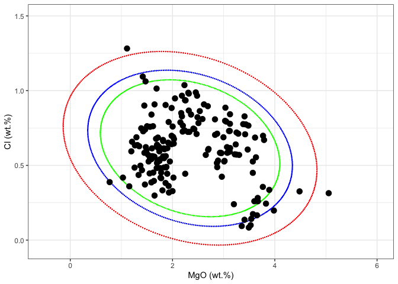
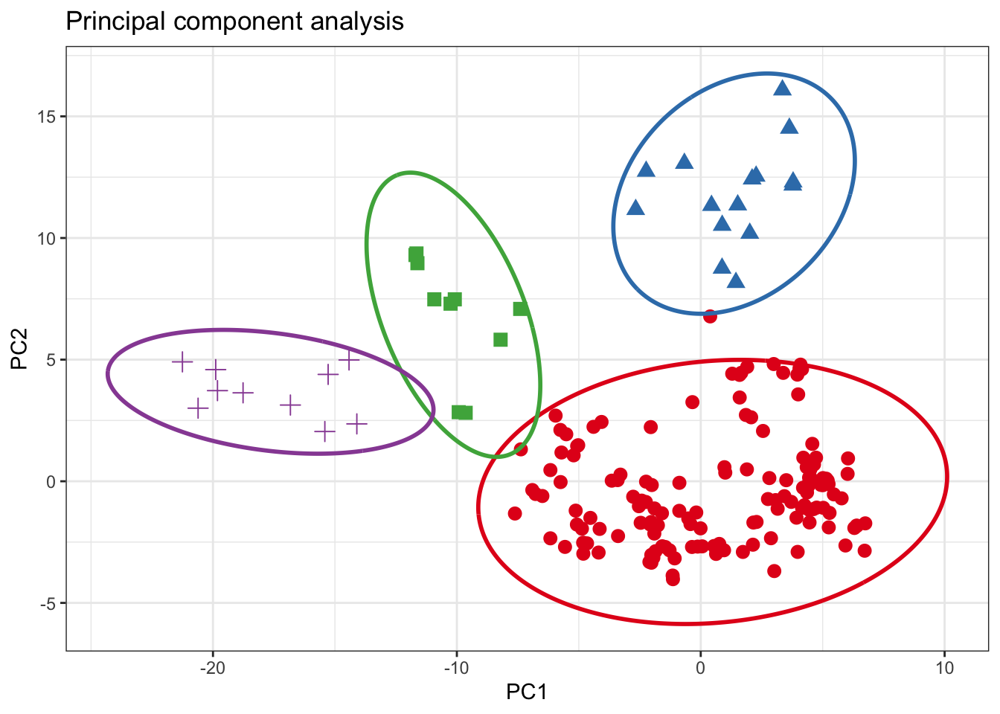

<!-- README.md is generated from README.Rmd. Please edit that file -->

# ConfidenceEllipse


<!-- badges: start -->

[](https://github.com/ChristianGoueguel/ConfidenceEllipse/actions/workflows/R-CMD-check.yaml)
[](https://www.repostatus.org/#active)
[](https://lifecycle.r-lib.org/articles/stages.html#stable)
[](https://opensource.org/licenses/MIT)
<!-- badges: end -->

The objective of the `ConfidenceEllipse` package is to compute the
confidence ellipse for a given bivariate normal data. The size of the
ellipse is determined by the confidence level, and the shape is
determined by the correlation structure between the variables. The
confidence level is usually chosen to be 95% or 99%, and the resulting
ellipse contains the points that are expected to lie within the
multivariate distribution.

## Installation

You can install the development version of `ConfidenceEllipse` like so:

``` r
# install.packages("remotes")
# remotes::install_github("ChristianGoueguel/ConfidenceEllipse")
```

## Example

### Dataset

The dataset is comprised of 13 different measurements for 180
archaeological glass vessels from different groups (Janssen, K.H.A., De
Raedt, I., Schalm, O., Veeckman, J.: Microchim. Acta 15 (suppl.) (1998)
253-267. Compositions of 15th - 17th century archaeological glass
vessels excavated in Antwerp.)

``` r
data(glass, package = "chemometrics")
data(glass.grp, package = "chemometrics")
```

``` r
df <-
  cbind(glass.grp, glass) %>%
  as_tibble() %>%
  rename(glassType = glass.grp) %>%
  modify_at("glassType", as_factor) %>%
  print()
#> # A tibble: 180 × 14
#>    glassType  Na2O   MgO Al2O3  SiO2  P2O5   SO3    Cl   K2O   CaO   MnO Fe2O3
#>    <fct>     <dbl> <dbl> <dbl> <dbl> <dbl> <dbl> <dbl> <dbl> <dbl> <dbl> <dbl>
#>  1 1          13.9  2.24  1.31  67.8 0.884 0.052 0.936  3.04  8.78 0.674 0.364
#>  2 1          14.2  2.18  1.31  67.1 0.938 0.024 0.966  3.40  8.64 0.698 0.336
#>  3 1          14.7  3.03  1.36  63.3 0.988 0.064 0.886  2.83 11.1  1.24  0.4  
#>  4 1          14.8  2.46  1.38  63.8 1.2   0.115 0.988  2.88 10.8  0.978 0.433
#>  5 1          14.1  2.48  1.07  68.8 0.682 0.07  0.966  2.40  8.81 0.31  0.242
#>  6 1          13.6  1.65  2.01  69.6 0.698 0.038 0.908  3.20  6.16 1.17  0.65 
#>  7 1          12.9  2.69  1.42  64.0 0.966 0.046 0.896  2.53 13.0  0.874 0.516
#>  8 1          15.7  2.03  1.24  70.6 0.21  0.31  0.676  2.33  6.32 0.214 0.278
#>  9 1          13.9  2.26  1.07  68.3 0.75  0.037 0.935  2.32  9.44 0.605 0.25 
#> 10 1          17.2  1.47  1.66  66.0 0.838 0.096 1.06   3.42  6.36 1.29  0.5  
#> # ℹ 170 more rows
#> # ℹ 2 more variables: BaO <dbl>, PbO <dbl>
```

### Confidence Ellipse

First, the `confidence_ellipse` function is used to compute coordinate
points of the confidence ellipse and then the ellipse is plotted on a
two-dimensional plot `x` and `y` of the data. Points that lie outside
the ellipse are considered to be outliers, while points that lie within
the ellipse are considered to be part of the underlying distribution
with the specified confidence level `conf_level`.

``` r
plot1 <- df %>%
  ggplot() +
  aes(x = MgO, y = Cl) +
  geom_point(color = "black", size = 3L) +
  xlim(-.5, 6) +
  ylim(-0.05, 1.5) +
  scale_color_brewer(palette = "Set1", direction = 1) +
  labs(x = "MgO (wt.%)", y = "Cl (wt.%)") +
  theme_bw() +
  theme(legend.position = "none")
```

``` r
ellipse_99 <- confidence_ellipse(df, x = MgO, y = Cl, conf_level = 0.99) %>% print()
#> # A tibble: 361 × 2
#>         x     y
#>     <dbl> <dbl>
#>  1 -0.138 0.770
#>  2 -0.138 0.759
#>  3 -0.138 0.748
#>  4 -0.137 0.737
#>  5 -0.135 0.726
#>  6 -0.132 0.715
#>  7 -0.129 0.704
#>  8 -0.124 0.693
#>  9 -0.119 0.681
#> 10 -0.114 0.670
#> # ℹ 351 more rows
```

``` r
ellipse_95 <- confidence_ellipse(df, x = MgO, y = Cl, conf_level = 0.95)
ellipse_90 <- confidence_ellipse(df, x = MgO, y = Cl, conf_level = 0.90)
```

``` r
plot2 <- 
  ggplot() +
  geom_point(data = ellipse_99, aes(x = x, y = y), color = "red", size = .1) +
  geom_point(data = ellipse_95, aes(x = x, y = y), color = "blue", size = .1) +
  geom_point(data = ellipse_90, aes(x = x, y = y), color = "green", size = .1) +
  geom_point(dat = df, aes(x = MgO, y = Cl), color = "black", size = 3L) +
  xlim(-.5, 6) +
  ylim(-0.05, 1.5) +
  scale_color_brewer(palette = "Set1", direction = 1) +
  labs(x = "MgO (wt.%)", y = "Cl (wt.%)") +
  theme_bw() +
  theme(legend.position = "none")
```

``` r
wrap_plots(plot1, plot2)
```



### Grouping

For grouping bivariate data, the `.group_by` argument can be used if the
data contains an unique grouping variable (`.group_by = NULL` by
default). When a grouping variable is provided, the function will
compute the ellipses separately for each level of the factor, allowing
you to explore potential differences or patterns within subgroups of the
data.

It’s important to note that the grouping variable should be
appropriately coded as a factor before passing it to the `.group_by`
argument. If the variable is currently stored as a character or numeric
type, you may need to convert it to a factor using functions like
`as.factor()` or `forcats::as_factor()`.

``` r
ellipse_grp <- df %>% confidence_ellipse(MgO, Cl, glassType) %>% print()
#> # A tibble: 1,444 × 3
#>        x     y glassType
#>    <dbl> <dbl> <fct>    
#>  1 0.568 0.676 1        
#>  2 0.568 0.669 1        
#>  3 0.569 0.662 1        
#>  4 0.570 0.655 1        
#>  5 0.572 0.648 1        
#>  6 0.574 0.641 1        
#>  7 0.577 0.634 1        
#>  8 0.580 0.627 1        
#>  9 0.584 0.620 1        
#> 10 0.589 0.613 1        
#> # ℹ 1,434 more rows
```

``` r
plot3 <- 
  ggplot() +
  geom_point(dat = df, aes(x = MgO, y = Cl, colour = glassType, shape = glassType), size = 3L) +
  geom_line(data = ellipse_grp, aes(x = x, y = y, colour = glassType), linewidth = .1) +
  xlim(0, 6) +
  ylim(-0.05, 1.5) +
  scale_color_brewer(palette = "Set1", direction = 1) +
  labs(x = "MgO (wt.%)", y = "Cl (wt.%)") +
  theme_bw() +
  theme(legend.position = "none")
```

``` r
wrap_plots(plot1, plot3)
```


``` r
rpca_scores <- df %>%
  select(where(is.numeric) )%>% 
  pcaPP::PCAproj(method = "qn") %>%
  pluck("scores") %>%
  as_tibble() %>%
  mutate(glassType = df %>% pull(glassType)) %>%
  rename(PC1 = Comp.1, PC2 = Comp.2) 
```

``` r
ellipse_pca <- rpca_scores %>%
confidence_ellipse(PC1, PC2, glassType)
```

``` r
plot4 <- 
  ggplot() +
  geom_point(dat = rpca_scores, aes(x = PC1, y = PC2, colour = glassType, shape = glassType), size = 3L) +
  geom_line(data = ellipse_pca, aes(x = x, y = y, colour = glassType), linewidth = .1) +
  scale_color_brewer(palette = "Set1", direction = 1) +
  labs(x = "PC1", y = "PC2") +
  theme_bw() +
  theme(legend.position = "none")
```

``` r
plot4
```


