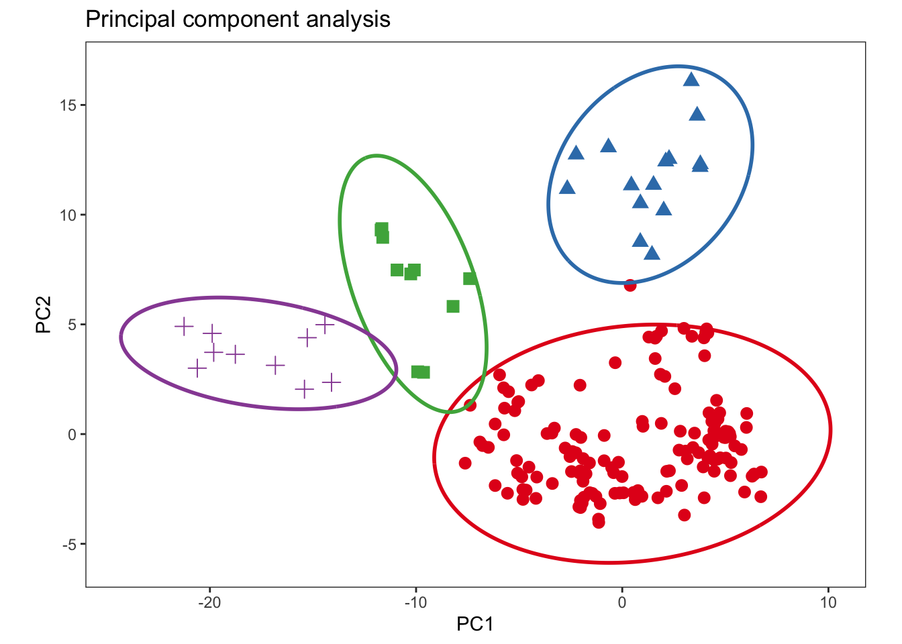
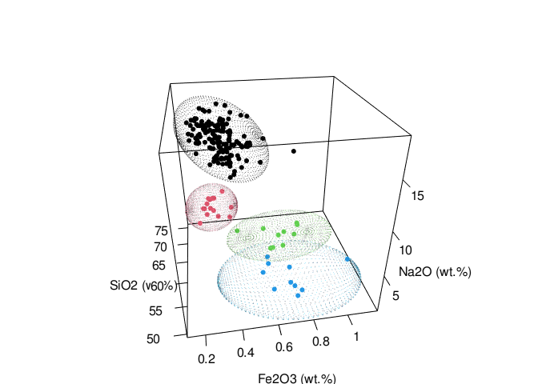

<!-- README.md is generated from README.Rmd. Please edit that file -->
<!-- badges: start -->

# 

[](https://github.com/ChristianGoueguel/ConfidenceEllipse/actions/workflows/R-CMD-check.yaml)
[](https://www.repostatus.org/#active)
[](https://lifecycle.r-lib.org/articles/stages.html#stable)
[](https://opensource.org/licenses/MIT)
[](https://app.codecov.io/gh/ChristianGoueguel/ConfidenceEllipse)
[](https://cran.r-project.org/package=ConfidenceEllipse)
[](https://cran.r-project.org/package=ConfidenceEllipse)
[](https://cran.r-project.org/package=ConfidenceEllipse)
[](https://CRAN.R-project.org/package=ConfidenceEllipse)
<!-- badges: end -->

The `ConfidenceEllipse` package computes the coordinate points of
confidence region for a given bivariate and trivariate dataset. The size
of the elliptical region is determined by the confidence level, and the
shape is determined by the covariance matrix. The confidence level is
usually chosen to be 95% or 99%, and the resulting confidence region
contains the points that are expected to lie within the multivariate
distribution.

## Installation

You can install `ConfidenceEllipse` from CRAN using:

``` r
install.packages("ConfidenceEllipse")
```

Alternatively you can grab the development version from github using
devtools:

``` r
install.packages("devtools")
devtools::install_github("ChristianGoueguel/ConfidenceEllipse")
```

## Example

``` r
library(magrittr)
library(tidyselect)
library(patchwork)
library(dplyr)
library(ggplot2)
library(purrr)
library(tidyr)
```

``` r
library(ConfidenceEllipse)
```

### Dataset

The dataset is comprised of 13 different measurements for 180
archaeological glass vessels from different groups (Janssen, K.H.A., De
Raedt, I., Schalm, O., Veeckman, J.: Microchim. Acta 15 (suppl.) (1998)
253-267. Compositions of 15th - 17th century archaeological glass
vessels excavated in Antwerp.)

``` r
data("glass", package = "ConfidenceEllipse")
```

``` r
glass %>% glimpse()
#> Rows: 180
#> Columns: 14
#> $ glassType <fct> 1, 1, 1, 1, 1, 1, 1, 1, 1, 1, 1, 1, 1, 1, 1, 1, 1, 1, 2, 2, …
#> $ Na2O      <dbl> 13.904, 14.194, 14.668, 14.800, 14.078, 13.600, 12.942, 15.6…
#> $ MgO       <dbl> 2.244, 2.184, 3.034, 2.455, 2.480, 1.648, 2.690, 2.028, 2.25…
#> $ Al2O3     <dbl> 1.312, 1.310, 1.362, 1.385, 1.072, 2.012, 1.420, 1.242, 1.07…
#> $ SiO2      <dbl> 67.752, 67.076, 63.254, 63.790, 68.768, 69.628, 64.012, 70.6…
#> $ P2O5      <dbl> 0.884, 0.938, 0.988, 1.200, 0.682, 0.698, 0.966, 0.210, 0.75…
#> $ SO3       <dbl> 0.052, 0.024, 0.064, 0.115, 0.070, 0.038, 0.046, 0.310, 0.03…
#> $ Cl        <dbl> 0.936, 0.966, 0.886, 0.988, 0.966, 0.908, 0.896, 0.676, 0.93…
#> $ K2O       <dbl> 3.044, 3.396, 2.828, 2.878, 2.402, 3.196, 2.526, 2.326, 2.32…
#> $ CaO       <dbl> 8.784, 8.636, 11.088, 10.833, 8.808, 6.160, 12.982, 6.324, 9…
#> $ MnO       <dbl> 0.674, 0.698, 1.240, 0.978, 0.310, 1.170, 0.874, 0.214, 0.60…
#> $ Fe2O3     <dbl> 0.364, 0.336, 0.400, 0.433, 0.242, 0.650, 0.516, 0.278, 0.25…
#> $ BaO       <dbl> 0.040, 0.040, 0.046, 0.025, 0.022, 0.156, 0.014, 0.032, 0.02…
#> $ PbO       <dbl> 0.004, 0.198, 0.134, 0.120, 0.102, 0.136, 0.120, 0.062, 0.02…
```

### Confidence Region

#### Classical and robust confidence ellipses

First, the `confidence_ellipse` function is used to compute coordinate
points of the confidence ellipse and then the ellipse is plotted on a
two-dimensional plot `x` and `y` of the data. Points that lie outside
the ellipse are considered to be outliers, while points that lie within
the ellipse are considered to be part of the underlying distribution
with the specified confidence level `conf_level`.

``` r
ellipse_95 <- confidence_ellipse(glass, x = SiO2, y = Na2O, conf_level = 0.95)
rob_ellipse_95 <- confidence_ellipse(glass, x = SiO2, y = Na2O, conf_level = 0.95, robust = TRUE)
```

``` r
ellipse_95 %>% glimpse()
#> Rows: 361
#> Columns: 2
#> $ x <dbl> 74.45896, 74.35724, 74.25314, 74.14669, 74.03792, 73.92686, 73.81356…
#> $ y <dbl> 21.99964, 22.08244, 22.16235, 22.23932, 22.31335, 22.38440, 22.45245…
```

``` r
cutoff <- qchisq(0.95, df = 2)
 MDsquared <- glass %>%
  select(SiO2, Na2O) %>%
  as.matrix() %>%
  mahalanobis(colMeans(.), cov(.), inverted = FALSE)
```

``` r
plot1 <- 
  ggplot() +
  geom_path(data = ellipse_95, aes(x = x, y = y), color = "blue", linewidth = 1L) +
  geom_point(data = glass %>% mutate(md = MDsquared) %>% filter(md <= cutoff), aes(x = SiO2, y = Na2O), shape = 21L, color = "black", fill = "lightblue", size = 3L) +
  geom_point(data = glass %>% mutate(md = MDsquared) %>% filter(md > cutoff), aes(x = SiO2, y = Na2O), shape = 21L, color = "black", fill = "gold", size = 3L) +
  labs(x = "SiO2 (wt.%)", y = "Na2O (wt.%)", title = "Classical confidence ellipse\nat 95% confidence level") +
  theme_bw() +
  theme(
    panel.grid = element_blank(),
    legend.position = "none"
    )
```

``` r
x_mcd <- glass %>%
  select(SiO2, Na2O) %>%
  as.matrix() %>%
  robustbase::covMcd()
```

``` r
rob_MDsquared <- glass %>%
  select(SiO2, Na2O) %>%
  as.matrix() %>%
  mahalanobis(x_mcd$center, x_mcd$cov)
```

``` r
plot2 <- 
  ggplot() +
  geom_path(data = rob_ellipse_95, aes(x = x, y = y), color = "blue", linewidth = 1L) +
  geom_point(data = glass %>% mutate(md = rob_MDsquared) %>% filter(md <= cutoff), aes(x = SiO2, y = Na2O), shape = 21L, color = "black", fill = "lightblue", size = 3L) +
  geom_point(data = glass %>% mutate(md = rob_MDsquared) %>% filter(md > cutoff), aes(x = SiO2, y = Na2O), shape = 21L, color = "black", fill = "gold", size = 3L) +
  labs(x = "SiO2 (wt.%)", y = "Na2O (wt.%)", title = "Robust confidence ellipse\nat 95% confidence level") +
  theme_bw() +
  theme(
    panel.grid = element_blank(),
    legend.position = "none"
    )
```

``` r
plot1 | plot2
```


##### Grouping

For grouping bivariate data, the `.group_by` argument can be used if the
data contains an unique grouping variable (`.group_by = NULL` by
default). When a grouping variable is provided, the function will
compute the ellipses separately for each level of the factor, allowing
you to explore potential differences or patterns within subgroups of the
data.

It’s important to note that the grouping variable should be
appropriately coded as a factor before passing it to the `.group_by`
argument. If the variable is currently stored as a character or numeric
type, you may need to convert it to a factor using functions like
`as.factor()` or `forcats::as_factor()`.

``` r
rpca_scores <- glass %>%
  select(where(is.numeric) )%>% 
  pcaPP::PCAproj(method = "qn") %>%
  pluck("scores") %>%
  as_tibble() %>%
  mutate(glassType = glass %>% pull(glassType)) %>%
  rename(PC1 = Comp.1, PC2 = Comp.2) 
```

``` r
ellipse_pca <- rpca_scores %>% confidence_ellipse(x = PC1, y = PC2, .group_by = glassType)
```

``` r
ggplot() +
  geom_point(data = rpca_scores, aes(x = PC1, y = PC2, color = glassType, shape = glassType), size = 3L) +
  geom_path(data = ellipse_pca, aes(x = x, y = y, color = glassType), linewidth = 1L) +
  scale_color_brewer(palette = "Set1", direction = 1) +
  labs(x = "PC1", y = "PC2", title = "Principal component analysis") +
  theme_bw() +
  theme(
    aspect.ratio = .7,
    panel.grid = element_blank(),
    legend.position = "none"
    )
```



#### Ellipsoid

The `confidence_ellipsoid` function accepts an additional variable `z`
and computes the ellipsoid for trivariate data.

``` r
ellipsoid_grp <- glass %>% confidence_ellipsoid(SiO2, Na2O, Fe2O3, glassType)
```

``` r
ellipsoid_grp %>% glimpse()
#> Rows: 10,000
#> Columns: 4
#> $ x         <dbl> 67.32486, 67.32486, 67.32486, 67.32486, 67.32486, 67.32486, …
#> $ y         <dbl> 14.51964, 14.51964, 14.51964, 14.51964, 14.51964, 14.51964, …
#> $ z         <dbl> 0.5971494, 0.5971494, 0.5971494, 0.5971494, 0.5971494, 0.597…
#> $ glassType <fct> 1, 1, 1, 1, 1, 1, 1, 1, 1, 1, 1, 1, 1, 1, 1, 1, 1, 1, 1, 1, …
```

``` r
rgl::setupKnitr(autoprint = TRUE)
rgl::plot3d(
  x = ellipsoid_grp$x, 
  y = ellipsoid_grp$y, 
  z = ellipsoid_grp$z,
  xlab = "SiO2 (wt.%)", 
  ylab = "Na2O (wt.%)", 
  zlab = "Fe2O3 (wt.%)",
  type = "s", 
  radius = 0.03,
  col = as.numeric(ellipsoid_grp$glassType)
  )
rgl::points3d(
  x = glass$SiO2, 
  y = glass$Na2O, 
  z = glass$Fe2O3, 
  col = as.numeric(glass$glassType),
  size = 5
  )
rgl::view3d(theta = 260, phi = 30, fov = 60, zoom = .85)
```


