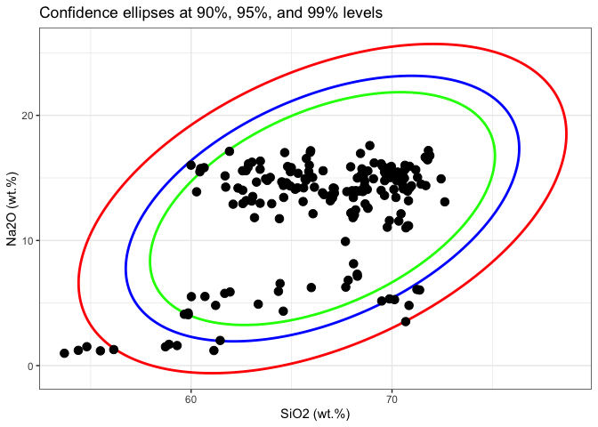
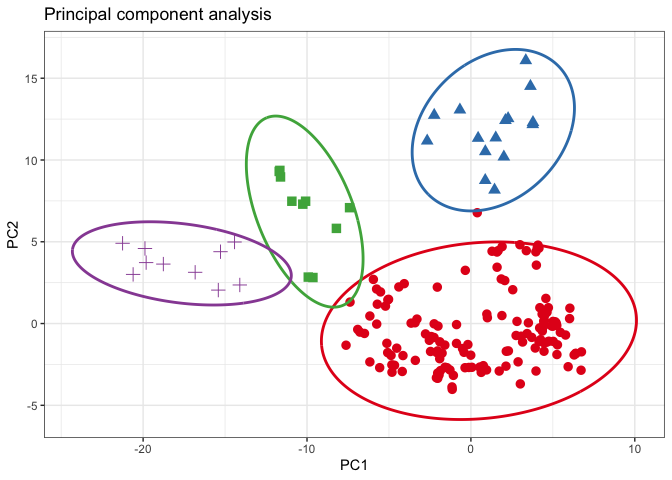

<!-- README.md is generated from README.Rmd. Please edit that file -->
<!-- badges: start -->

# ConfidenceEllipse 

[](https://github.com/ChristianGoueguel/ConfidenceEllipse/actions/workflows/R-CMD-check.yaml)
[](https://www.repostatus.org/#active)
[](https://lifecycle.r-lib.org/articles/stages.html#stable)
[](https://opensource.org/licenses/MIT)
[](https://app.codecov.io/gh/ChristianGoueguel/ConfidenceEllipse)
<!-- badges: end -->

The `ConfidenceEllipse` package computes the coordinate points of
confidence ellipses and ellipsoids for a given bivariate and trivariate
normal data. The size of the ellipse and ellipsoid is determined by the
confidence level, and the shape is determined by the covariance matrix.
The confidence level is usually chosen to be 95% or 99%, and the
resulting confidence region contains the points that are expected to lie
within the multivariate distribution.

## Installation

You can install the development version of `ConfidenceEllipse` like so:

``` r
# install.packages("remotes")
# remotes::install_github("ChristianGoueguel/ConfidenceEllipse")
```

## Example

``` r
library(magrittr)
library(tidyselect)
library(dplyr)
library(ggplot2)
library(purrr)
library(tidyr)
```

``` r
library(ConfidenceEllipse)
```

### Dataset

The dataset is comprised of 13 different measurements for 180
archaeological glass vessels from different groups (Janssen, K.H.A., De
Raedt, I., Schalm, O., Veeckman, J.: Microchim. Acta 15 (suppl.) (1998)
253-267. Compositions of 15th - 17th century archaeological glass
vessels excavated in Antwerp.)

``` r
data("glass", package = "ConfidenceEllipse")
```

``` r
glass %>% glimpse()
#> Rows: 180
#> Columns: 14
#> $ glassType <fct> 1, 1, 1, 1, 1, 1, 1, 1, 1, 1, 1, 1, 1, 1, 1, 1, 1, 1, 2, 2, …
#> $ Na2O      <dbl> 13.904, 14.194, 14.668, 14.800, 14.078, 13.600, 12.942, 15.6…
#> $ MgO       <dbl> 2.244, 2.184, 3.034, 2.455, 2.480, 1.648, 2.690, 2.028, 2.25…
#> $ Al2O3     <dbl> 1.312, 1.310, 1.362, 1.385, 1.072, 2.012, 1.420, 1.242, 1.07…
#> $ SiO2      <dbl> 67.752, 67.076, 63.254, 63.790, 68.768, 69.628, 64.012, 70.6…
#> $ P2O5      <dbl> 0.884, 0.938, 0.988, 1.200, 0.682, 0.698, 0.966, 0.210, 0.75…
#> $ SO3       <dbl> 0.052, 0.024, 0.064, 0.115, 0.070, 0.038, 0.046, 0.310, 0.03…
#> $ Cl2O      <dbl> 0.936, 0.966, 0.886, 0.988, 0.966, 0.908, 0.896, 0.676, 0.93…
#> $ K2O       <dbl> 3.044, 3.396, 2.828, 2.878, 2.402, 3.196, 2.526, 2.326, 2.32…
#> $ CaO       <dbl> 8.784, 8.636, 11.088, 10.833, 8.808, 6.160, 12.982, 6.324, 9…
#> $ MnO       <dbl> 0.674, 0.698, 1.240, 0.978, 0.310, 1.170, 0.874, 0.214, 0.60…
#> $ Fe2O3     <dbl> 0.364, 0.336, 0.400, 0.433, 0.242, 0.650, 0.516, 0.278, 0.25…
#> $ BaO       <dbl> 0.040, 0.040, 0.046, 0.025, 0.022, 0.156, 0.014, 0.032, 0.02…
#> $ PbO       <dbl> 0.004, 0.198, 0.134, 0.120, 0.102, 0.136, 0.120, 0.062, 0.02…
```

### Confidence Ellipse

First, the `confidence_ellipse` function is used to compute coordinate
points of the confidence ellipse and then the ellipse is plotted on a
two-dimensional plot `x` and `y` of the data. Points that lie outside
the ellipse are considered to be outliers, while points that lie within
the ellipse are considered to be part of the underlying distribution
with the specified confidence level `conf_level`.

``` r
ellipse_99 <- confidence_ellipse(glass, x = SiO2, y = Na2O, conf_level = 0.99)
ellipse_95 <- confidence_ellipse(glass, x = SiO2, y = Na2O, conf_level = 0.95)
ellipse_90 <- confidence_ellipse(glass, x = SiO2, y = Na2O, conf_level = 0.90)
```

``` r
ellipse_99 %>% glimpse()
#> Rows: 361
#> Columns: 2
#> $ x <dbl> 76.35866, 76.23254, 76.10346, 75.97148, 75.83662, 75.69893, 75.55845…
#> $ y <dbl> 24.26617, 24.36884, 24.46791, 24.56335, 24.65513, 24.74322, 24.82760…
```

``` r
ggplot() +
  geom_path(data = ellipse_99, aes(x = x, y = y), color = "red", linewidth = 1L) +
  geom_path(data = ellipse_95, aes(x = x, y = y), color = "blue", linewidth = 1L) +
  geom_path(data = ellipse_90, aes(x = x, y = y), color = "green", linewidth = 1L) +
  geom_point(data = glass, aes(x = SiO2, y = Na2O), color = "black", size = 3L) +
  scale_color_brewer(palette = "Set1", direction = 1) +
  labs(
    x = "SiO2 (wt.%)", 
    y = "Na2O (wt.%)",
    title = "Confidence ellipses at 90%, 95%, and 99% levels") +
  theme_bw() +
  theme(legend.position = "none")
```



#### Grouping

For grouping bivariate data, the `.group_by` argument can be used if the
data contains an unique grouping variable (`.group_by = NULL` by
default). When a grouping variable is provided, the function will
compute the ellipses separately for each level of the factor, allowing
you to explore potential differences or patterns within subgroups of the
data.

It’s important to note that the grouping variable should be
appropriately coded as a factor before passing it to the `.group_by`
argument. If the variable is currently stored as a character or numeric
type, you may need to convert it to a factor using functions like
`as.factor()` or `forcats::as_factor()`.

``` r
rpca_scores <- glass %>%
  select(where(is.numeric) )%>% 
  pcaPP::PCAproj(method = "qn") %>%
  pluck("scores") %>%
  as_tibble() %>%
  mutate(glassType = glass %>% pull(glassType)) %>%
  rename(PC1 = Comp.1, PC2 = Comp.2) 
```

``` r
ellipse_pca <- rpca_scores %>%
confidence_ellipse(x = PC1, y = PC2, .group_by = glassType)
```

``` r
ggplot() +
  geom_point(data = rpca_scores, aes(x = PC1, y = PC2, colour = glassType, shape = glassType), size = 3L) +
  geom_path(data = ellipse_pca, aes(x = x, y = y, colour = glassType), linewidth = 1L) +
  scale_color_brewer(palette = "Set1", direction = 1) +
  labs(
    x = "PC1", 
    y = "PC2",
    title = "Principal component analysis") +
  theme_bw() +
  theme(legend.position = "none")
```



### Confidence Ellipsoid

The `confidence_ellipsoid` function accepts an additional variable `z`
and computes the ellipsoid for trivariate data.

``` r
ellipsoid_grp <- glass %>% 
  confidence_ellipsoid(SiO2, Na2O, Fe2O3, glassType)
```

``` r
ellipsoid_grp %>% glimpse()
#> Rows: 10,000
#> Columns: 4
#> $ x         <dbl> 67.32486, 67.32486, 67.32486, 67.32486, 67.32486, 67.32486, …
#> $ y         <dbl> 14.51964, 14.51964, 14.51964, 14.51964, 14.51964, 14.51964, …
#> $ z         <dbl> 0.5971494, 0.5971494, 0.5971494, 0.5971494, 0.5971494, 0.597…
#> $ glassType <fct> 1, 1, 1, 1, 1, 1, 1, 1, 1, 1, 1, 1, 1, 1, 1, 1, 1, 1, 1, 1, …
```

``` r
rgl::setupKnitr(autoprint = TRUE)
rgl::plot3d(
  x = ellipsoid_grp$x, 
  y = ellipsoid_grp$y, 
  z = ellipsoid_grp$z,
  xlab = "SiO2 (wt.%)", 
  ylab = "Na2O (wt.%)", 
  zlab = "Fe2O3 (wt.%)",
  type = "s", 
  radius = 0.03,
  col = as.numeric(ellipsoid_grp$glassType)
  )
rgl::points3d(
  x = glass$SiO2, 
  y = glass$Na2O, 
  z = glass$Fe2O3, 
  col = as.numeric(glass$glassType),
  size = 5
  )
rgl::view3d(theta = 260, phi = 30, fov = 60, zoom = .85)
```


