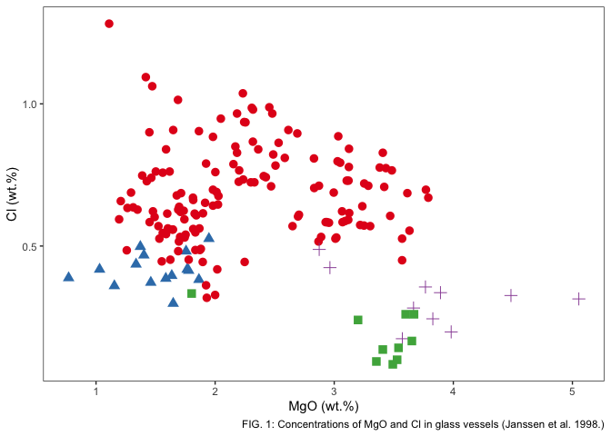

<!-- README.md is generated from README.Rmd. Please edit that file -->

# ConfidenceEllipse

<!-- badges: start -->
<!-- badges: end -->

The objective of the `ConfidenceEllipse` package is to compute the
confidence ellipse for a given bivariate normal data. The size of the
ellipse is determined by the confidence level, and the shape is
determined by the correlation structure between the variables. The
confidence level is usually chosen to be 95% or 99%, and the resulting
ellipse contains the points that are expected to lie within the
multivariate distribution. Points outside the ellipse might be
considered outliers.

## Installation

You can install the development version of `ConfidenceEllipse` like so:

``` r
# install.packages("remotes")
# remotes::install_github("ChristianGoueguel/ConfidenceEllipse")
```

## Example

### Dataset

The dataset is comprised of 13 different measurements for 180
archaeological glass vessels from different groups (Janssen, K.H.A., De
Raedt, I., Schalm, O., Veeckman, J.: Microchim. Acta 15 (suppl.) (1998)
253-267. Compositions of 15th - 17th century archaeological glass
vessels excavated in Antwerp.)

``` r
data(glass, package = "chemometrics")
data(glass.grp, package = "chemometrics")
```

``` r
df <-
  cbind(glass.grp, glass) %>%
  as_tibble() %>%
  rename(group = glass.grp) %>%
  modify_at("group", as_factor)
```

``` r
df %>%
  ggplot() +
  aes(x = MgO, y = Cl, colour = group, shape = group) +
  geom_point(size = 3L) +
  scale_color_brewer(palette = "Set1", direction = 1) +
  labs(
    x = "MgO (wt.%)",
    y = "Cl (wt.%)",
    caption = "FIG. 1: Concentrations of MgO and Cl in glass vessels (Janssen et al. 1998.)") +
  theme_bw() +
  theme(
    legend.position = "none",
    panel.grid = element_blank()
    )
```


