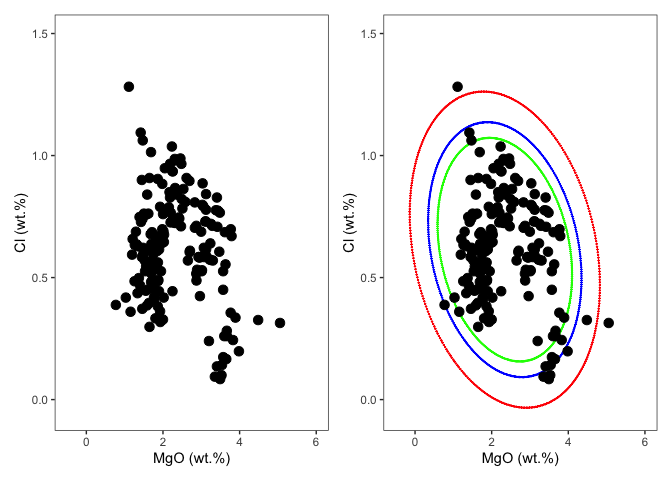
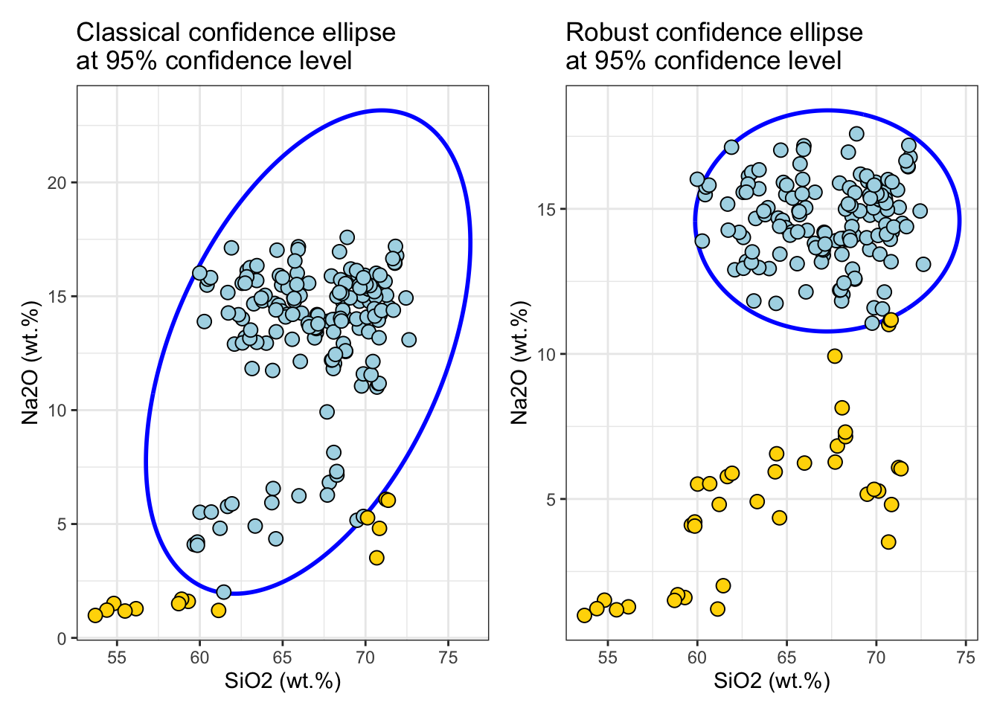

<!-- README.md is generated from README.Rmd. Please edit that file -->

# ConfidenceEllipse


<!-- badges: start -->

[](https://opensource.org/licenses/MIT)
<!-- badges: end -->

The objective of the `ConfidenceEllipse` package is to compute the
confidence ellipse for a given bivariate normal data. The size of the
ellipse is determined by the confidence level, and the shape is
determined by the correlation structure between the variables. The
confidence level is usually chosen to be 95% or 99%, and the resulting
ellipse contains the points that are expected to lie within the
multivariate distribution. Points outside the ellipse might be
considered outliers.

## Installation

You can install the development version of `ConfidenceEllipse` like so:

``` r
# install.packages("remotes")
# remotes::install_github("ChristianGoueguel/ConfidenceEllipse")
```

## Example

### Dataset

The dataset is comprised of 13 different measurements for 180
archaeological glass vessels from different groups (Janssen, K.H.A., De
Raedt, I., Schalm, O., Veeckman, J.: Microchim. Acta 15 (suppl.) (1998)
253-267. Compositions of 15th - 17th century archaeological glass
vessels excavated in Antwerp.)

``` r
data(glass, package = "chemometrics")
data(glass.grp, package = "chemometrics")
```

``` r
df <-
  cbind(glass.grp, glass) %>%
  as_tibble() %>%
  rename(group = glass.grp) %>%
  modify_at("group", as_factor) %>%
  print()
#> # A tibble: 180 × 14
#>    group  Na2O   MgO Al2O3  SiO2  P2O5   SO3    Cl   K2O   CaO   MnO Fe2O3   BaO
#>    <fct> <dbl> <dbl> <dbl> <dbl> <dbl> <dbl> <dbl> <dbl> <dbl> <dbl> <dbl> <dbl>
#>  1 1      13.9  2.24  1.31  67.8 0.884 0.052 0.936  3.04  8.78 0.674 0.364 0.04 
#>  2 1      14.2  2.18  1.31  67.1 0.938 0.024 0.966  3.40  8.64 0.698 0.336 0.04 
#>  3 1      14.7  3.03  1.36  63.3 0.988 0.064 0.886  2.83 11.1  1.24  0.4   0.046
#>  4 1      14.8  2.46  1.38  63.8 1.2   0.115 0.988  2.88 10.8  0.978 0.433 0.025
#>  5 1      14.1  2.48  1.07  68.8 0.682 0.07  0.966  2.40  8.81 0.31  0.242 0.022
#>  6 1      13.6  1.65  2.01  69.6 0.698 0.038 0.908  3.20  6.16 1.17  0.65  0.156
#>  7 1      12.9  2.69  1.42  64.0 0.966 0.046 0.896  2.53 13.0  0.874 0.516 0.014
#>  8 1      15.7  2.03  1.24  70.6 0.21  0.31  0.676  2.33  6.32 0.214 0.278 0.032
#>  9 1      13.9  2.26  1.07  68.3 0.75  0.037 0.935  2.32  9.44 0.605 0.25  0.027
#> 10 1      17.2  1.47  1.66  66.0 0.838 0.096 1.06   3.42  6.36 1.29  0.5   0.112
#> # ℹ 170 more rows
#> # ℹ 1 more variable: PbO <dbl>
```

### Confidence Ellipse

First, the `confidence_ellipse` function is used to compute coordinate
points of the confidence ellipse and then the ellipse is plotted on a
two-dimensional plot `x` and `y` of the data. Points that lie outside
the ellipse are considered to be outliers, while points that lie within
the ellipse are considered to be part of the underlying distribution
with the specified confidence level `conf_level`.

``` r
plot1 <- df %>%
  ggplot() +
  aes(x = MgO, y = Cl) +
  geom_point(color = "black", size = 3L) +
  xlim(-.5, 6) +
  ylim(-0.05, 1.5) +
  scale_color_brewer(palette = "Set1", direction = 1) +
  labs(x = "MgO (wt.%)", y = "Cl (wt.%)") +
  theme_bw() +
  theme(legend.position = "none", panel.grid = element_blank())
```

``` r
ellipse_99 <- confidence_ellipse(df, x = MgO, y = Cl, conf_level = 0.99)
ellipse_95 <- confidence_ellipse(df, x = MgO, y = Cl, conf_level = 0.95)
ellipse_90 <- confidence_ellipse(df, x = MgO, y = Cl, conf_level = 0.90)
```

``` r
plot2 <- 
  ggplot() +
  geom_point(data = ellipse_99, aes(x = x, y = y), color = "red", size = .1) +
  geom_point(data = ellipse_95, aes(x = x, y = y), color = "blue", size = .1) +
  geom_point(data = ellipse_90, aes(x = x, y = y), color = "green", size = .1) +
  geom_point(dat = df, aes(x = MgO, y = Cl), color = "black", size = 3L) +
  xlim(-.5, 6) +
  ylim(-0.05, 1.5) +
  scale_color_brewer(palette = "Set1", direction = 1) +
  labs(x = "MgO (wt.%)", y = "Cl (wt.%)") +
  theme_bw() +
  theme(legend.position = "none", panel.grid = element_blank())
```

``` r
wrap_plots(plot1, plot2)
```



### Grouping

Here, we consider situations in which the data are stratified in four
samples by a factor (“group”) that might correspond to different glass
proprieties. In that case, one needs to set `by_group = TRUE`.

There are two ways to interpret the ellipses: as confidence curves for
bivariate normal distributions and as indicators of correlation. As
confidence curves, the ellipses show where the specified percentage of
the data should lie, assuming a bivariate normal distribution. Under
bivariate normality, the percentage of observations falling inside the
ellipse should closely agree with the specified confidence level. You
can examine the effect of increasing or decreasing the confidence level
by adjusting the slider in the Confidence Ellipses table below the
scatter plot matrix. Confidence ellipses can also serve as visual
indicators of correlations. The confidence ellipse collapses diagonally
as the correlation between two variables approaches 1 or -1. The
confidence ellipse is more circular when two variables are uncorrelated.

(Moore, D.S. and McCabe, G.P. (1989), Introduce of the Practice of
Statistics)

``` r
ellipse_grp <- confidence_ellipse(df, x = MgO, y = Cl, by_group = TRUE)
```

``` r
plot3 <- 
  ggplot() +
  geom_point(dat = df, aes(x = MgO, y = Cl, colour = group, shape = group), size = 3L) +
  geom_line(data = ellipse_grp, aes(x = x, y = y, colour = group), linewidth = .1) +
  xlim(0, 6) +
  ylim(-0.05, 1.5) +
  scale_color_brewer(palette = "Set1", direction = 1) +
  labs(x = "MgO (wt.%)", y = "Cl (wt.%)") +
  theme_bw() +
  theme(legend.position = "none", panel.grid = element_blank())
```

``` r
wrap_plots(plot1, plot3)
```


``` r
rpca_scores <- df %>% 
  select(where(is.numeric) )%>% 
  pcaPP::PCAproj(method = "qn") %>%
  pluck("scores") %>%
  as_tibble() %>%
  mutate(group = df %>% pull(group)) %>%
  rename(PC1 = Comp.1, PC2 = Comp.2) 
```

``` r
ellipse_pca <- rpca_scores %>%
confidence_ellipse(x = PC1, y = PC2, by_group = TRUE)
```

``` r
plot4 <- 
  ggplot() +
  geom_point(dat = rpca_scores, aes(x = PC1, y = PC2, colour = group, shape = group), size = 3L) +
  geom_line(data = ellipse_pca, aes(x = x, y = y, colour = group), linewidth = .1) +
  scale_color_brewer(palette = "Set1", direction = 1) +
  labs(x = "PC1", y = "PC2") +
  theme_bw() +
  theme(legend.position = "none")
```

``` r
plot4
```


